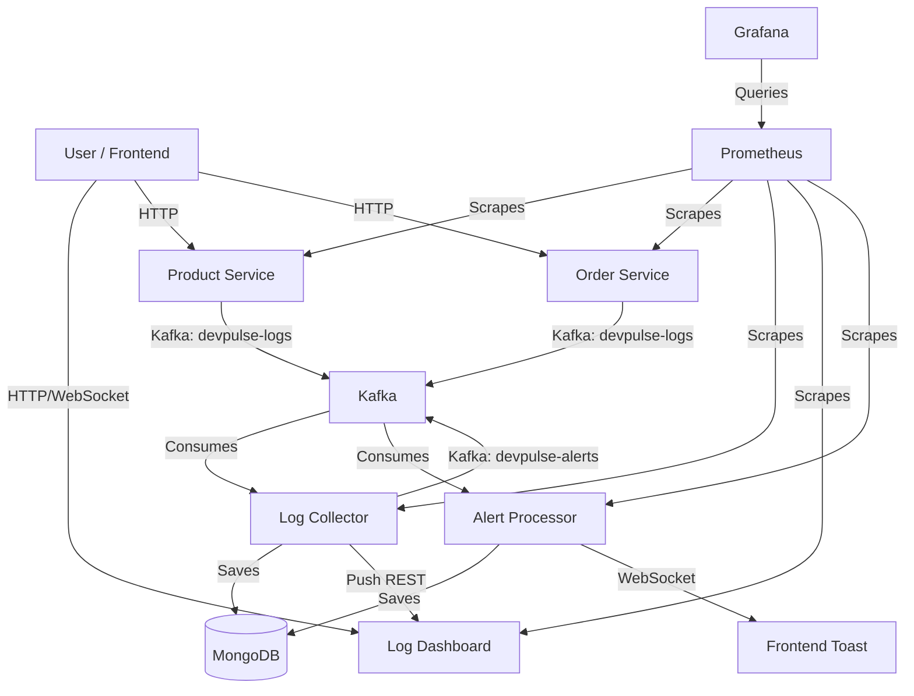

# DevPulse Architecture

DevPulse is a microservices-based observability platform designed to demonstrate end-to-end logging, monitoring, and alerting.

## High-Level Overview

## Services

### 1. Frontend (`frontend`)
*   **Tech**: React, Vite, TailwindCSS.
*   **Role**: Main user interface.
*   **Features**:
    *   Live Log Stream (Server-Sent Events).
    *   Dashboard with charts (Recharts).
    *   Alert Toasts (WebSocket).
    *   Grafana Embed.
    *   Product & Order Management.

### 2. Log Collector (`log-collector`)
*   **Tech**: Spring Boot, Kafka Consumer, MongoDB.
*   **Role**: Central processing unit.
*   **Responsibilities**:
    *   Consumes logs from `devpulse-logs`.
    *   Validates and persists logs to MongoDB (`logs` collection).
    *   Detects "Invalid Logs" (malformed JSON) and saves them to `logs_errors`.
    *   Pushes processed logs to `log-dashboard` for live streaming.

### 3. Log Dashboard (`log-dashboard`)
*   **Tech**: Spring Boot, Spring Data MongoDB.
*   **Role**: Query and Streaming engine.
*   **Responsibilities**:
    *   Exposes REST APIs for querying logs (search, filter, pagination).
    *   Manages SSE (Server-Sent Events) connections for live streaming.

### 4. Alert Processor (`alert-processor`)
*   **Tech**: Spring Boot, Kafka Consumer/Producer.
*   **Role**: Alerting engine.
*   **Responsibilities**:
    *   Consumes alerts from `devpulse-alerts`.
    *   Persists alerts to MongoDB (`alerts` collection).
    *   Broadcasts alerts to Frontend via WebSocket (`/alert-ws`).

### 5. Producers (`producer-product`, `producer-order`)
*   **Tech**: Spring Boot.
*   **Role**: Dummy traffic generators.
*   **Responsibilities**:
    *   Generate random logs (INFO, WARN, ERROR).
    *   Send logs to Kafka `devpulse-logs`.

## Infrastructure

*   **Kafka**: Message bus for decoupling services.
*   **MongoDB**: NoSQL database for storing logs and alerts.
*   **Prometheus**: Scrapes metrics from all services (Actuator).
*   **Grafana**: Visualizes metrics from Prometheus.
